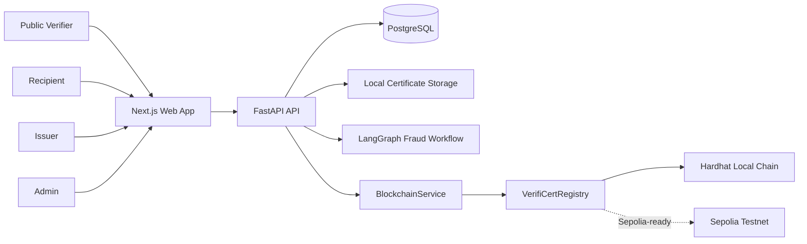
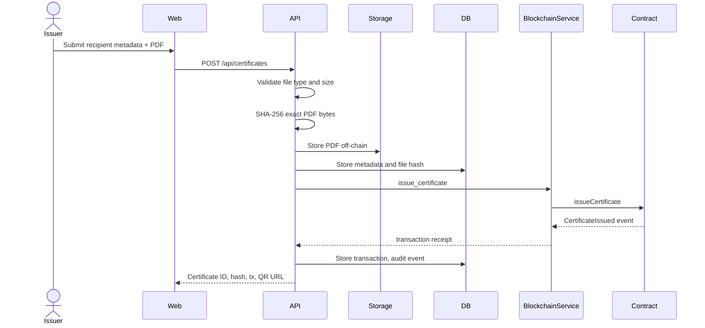
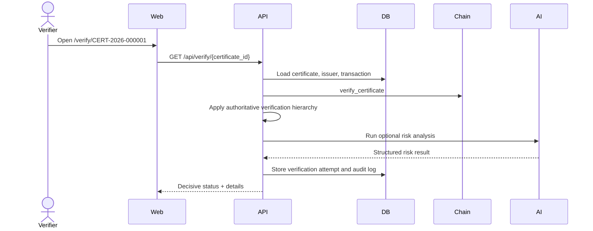
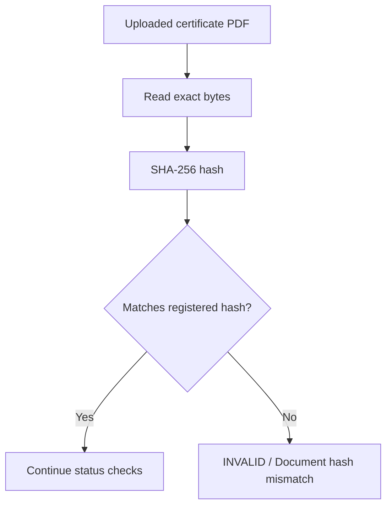
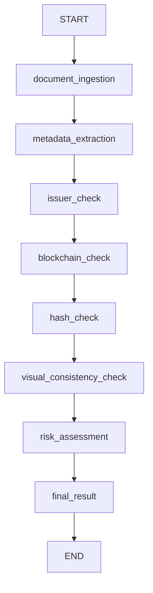
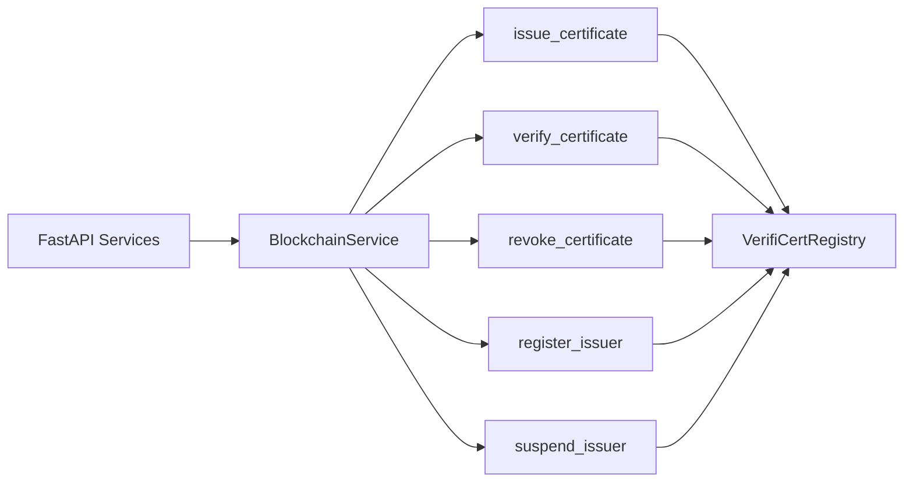
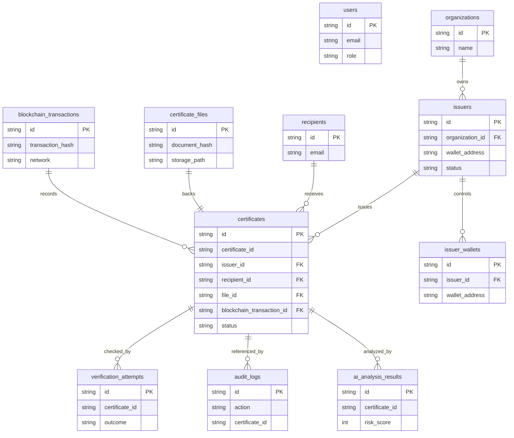

# VERIFICERT Architecture

## System Architecture

## Certificate Issuance Sequence

## Verification Sequence

## Upload Hash Check

## LangGraph Workflow

## Blockchain Interaction Flow

## Database ER Diagram

